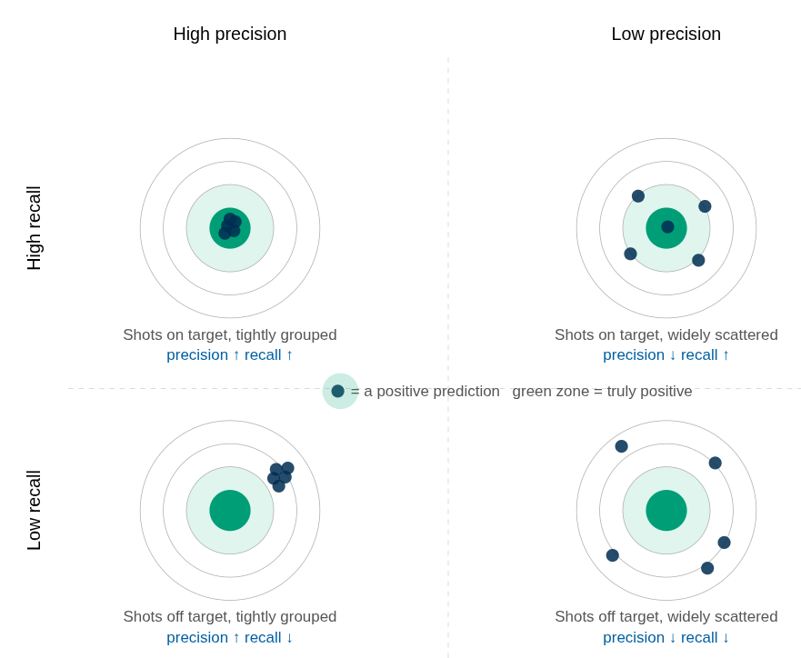

#+TITLE: CS 540 — Quiz 5 Review: Confusion Matrix & Classification Metrics
#+AUTHOR: Marcus Birkenkrahe
#+PROPERTY: header-args:python :session *cm-review* :results output
#+STARTUP: overview hideblocks indent entitiespretty:
* Review of Classification Metrics
#+attr_html: :width 700px :float nil: 
#+caption: Source: rmartinshort.jimdofree.com/2019/02/10/intro-to-classification-metrics/
[[../img/classification_metrics.png]]

** The confusion matrix explained

How should one read and remember this "confusion matrix"? Personally,
don't remember it but instead derive it from first principles and
illustrate it with an example - cancer prediction:

1. We are taking observations from a total population (that's everybody).
2. In the total population, we're predicting for a condition (a target
   label) - for example cancer. Some people have it (positive), others
   don't (negative). 
3. The target/condition is positively and accurately predicted for
   some people - this number is the *power* of the method (*True Positive*
   = TP) - for example patients who actually have cancer when
   diagnosed.
4. For other people, the model predicts falsely positively - they
   don't have cancer but the model says they do: This is a statistical
   *Type I error*. When diagnosed, it turns out there is no cancer
   (*False positive* - FP).
5. The model also predicts accurately that some patients do not have
   cancer (*True negative* - TN).
6. The worst category is a false negative prediction: The model says
   that the patient does not have cancer but the patient actually
   does. In this case, it may never be diagnosed, but it's there. This
   is also called a statistical *Type II* error (*False Negative* - FN).
7. When deciding on a model and a metric, one needs to take into
   account what the failure of the model will cost - this cannot be
   determined a priori. For example, in the case of spam/ham, FP is a
   message that's not spam but that was flagged as spam - it lands in
   the spam folder from where it can be retrieved. FN is a spam
   message that you have to deal with. But in the case of cancer, FP
   means extra diagnosis, which costs money, but FN could be a case of
   undetected cancer that is predicted as healthy and could mean
   death. So in the spam example, cost of FP > FN, but for cancer, FN
   > FP.

** The most important metrics: Accuracy, Precision, Recall

The image shows a large number of different metrics - ways to evaluate
the value of the prediction. The most important ones are discussed by DataCamp:

1) *Accuracy:* The total number of positives (meeting the
   condition/target) divided by the total number of examples. This
   will always be a number between 0 (TP = FP = 0) and 1 (FP = FN =
   0).

   Accuracy works well if the classes are *balanced* (there are roughly
   equal numbers of examples in each class). *Stratified sampling*
   preserves the class proportions of the target label in both train
   and test sets — which matters most when classes are imbalanced, to
   ensure the rare class is represented in both splits.

2) *Precision*: TP/(TP+FP) - Total precision means there are no false
   positives. The more false positives - patients with cancer
   predictions who don't have cancer - the less precise the
   prediction. Also called the *positive predictive value*.

3) *Recall*: TP/(TP+FN) - Totall recall means there are no false
   negatives. The more false negatives - patients with cancer who are
   predicted to be cancer-free - the lower the recall, or *sensitivity*
   of the prediction. Also called the *true positive rate* or the
   *probability of detection*.

** Three more metrics - Fall-out, Specificity, F_1 score

There are three additional measures that you'll see often:
1) *Fall-out*: FP/(FP+TN) is the probability of a false alarm. There's
   little fall-out when the condition negative prediction is dominated
   by true negatives. Also called the *probability of false alarm.*

2) *Specificity*: High TN/(TN+FP) or high selectivity means that there
   are few false positives. It's precision for condition negatives
   cases.

3) F_1 score: It is the harmonic mean of two numbers, R and P:
   \[
   F_1 = \frac{1}{\frac{1}{2}(\frac{1}{R}+\frac

   You can also express it as:
   \[
   F_1 =  2 \frac{precision * recall}{precision + recall}
   \]

   The first version shows the harmonic form. You take the mean of
   their reciprocals, and then take the mean of that. This is the
   natural average when you work with ratios or rates: Precision is
   the rate of positive prediction (measured with 1/FP), and recall is
   the rate of true positives (measured with 1/FN).

   Because it's a harmonic mean, for perfect recall and zero
   precision, F1=0 (instead of 0.5 for the arithmetic mean).

* The Scenario

A hospital deploys a model to screen 1,000 patients for a rare disease.

- 50 patients actually have the disease.
- 950 patients are healthy.
- The model flags 80 patients as positive (disease detected).
- Of those 80 flagged, 40 truly have the disease.

That is all you need. Everything else follows from these four numbers.

* Challenge 1 — Fill in the Confusion Matrix

Before writing any code, reason through the four cells from the
scenario above.

|                   | Predicted Positive | Predicted Negative       | Sums   |
|-------------------+--------------------+--------------------------+--------|
| Actually Positive | TP = 40            | FN = 50 - TP = 10        | = 50   |
| Actually Negative | FP = 80 - 40 = 40  | TN = 950 - TP = 910      | = 950  |
|-------------------+--------------------+--------------------------+--------|
|                   |                    |                          | = 1000 |

- TP :: flagged AND actually sick
- FN :: sick but /not/ flagged — the model missed them
- FP :: flagged but actually healthy — false alarm
- TN :: healthy AND correctly cleared

Fill in your answers, then run the block. The sanity checks will tell
you if your numbers are internally consistent.

#+BEGIN_SRC python
  # YOUR ANSWERS — change these values
  TP = 40   # flagged AND actually sick 
  FN = 10   # sick but not flagged 
  FP = 40   # flagged but actually healthy
  TN = 910   # healthy and correctly cleared

  # ── SANITY CHECKS ─────────────────────────────────────────────────────────────
  print(f"  TP + FN should equal total sick    (50):   {TP} + {FN} = {TP+FN}")
  print(f"  FP + TN should equal total healthy (950):  {FP} + {TN} = {FP+TN}")
  print(f"  TP + FP should equal total flagged (80):   {TP} + {FP} = {TP+FP}")
#+END_SRC

#+RESULTS:
:   TP + FN should equal total sick    (50):   40 + 10 = 50
:   FP + TN should equal total healthy (950):  40 + 910 = 950
:   TP + FP should equal total flagged (80):   40 + 40 = 80

* Challenge 2 — Compute Accuracy

What is the formula?
#+begin_quote
$$\text{Accuracy} = \frac{TP + TN}{TP + TN + FP + FN}$$
#+end_quote

Plain English: of all predictions made, what fraction were correct?
This answers: /how often is the model right overall?/

Compute it by hand first. What do you expect? Then run the block.

After you see the number, ask yourself: is 95% accuracy impressive
here? What would a model that predicts "healthy" for every single
patient score?

#+BEGIN_SRC python
  TP, FN, FP, TN = 40, 10, 40, 910

  # YOUR TURN: replace None with your formula
  accuracy = (TP+TN)/(TP+FN+FP+TN)

  print(f"Your accuracy: {accuracy}")
#+END_SRC

#+RESULTS:
: Your accuracy: 0.95

Answer:
#+begin_quote
Accuracy = (40 + 910) / 1000 = 0.95 (95%).

This looks impressive — until you consider a lazy model that predicts
"healthy" for every single patient. It makes zero positive predictions:
TP = 0, FP = 0, FN = 50, TN = 950. Its accuracy is 950/1000 = 0.95 —
identical. Yet it catches zero disease cases.

This is why accuracy fails on imbalanced data: the majority class (950
healthy patients) dominates the numerator and masks complete failure on
the minority class (50 sick patients). A model can score 95% by
ignoring the very thing it is supposed to detect.

Precision and recall expose this: the lazy model has recall = 0/50 = 0
and precision = undefined (it never flags anyone). No amount of
class-majority padding can hide a recall of zero.
#+end_quote

* Challenge 3 — Compute Precision

What is the formula?
#+begin_quote
$$\text{Precision} = \frac{TP}{TP + FP}$$
#+end_quote

Plain English: of everyone the model /flagged/, what fraction truly had
the disease? This answers: *how much do we trust a positive prediction?*

#+BEGIN_SRC python
  TP, FN, FP, TN = 40, 10, 40, 910

  # YOUR TURN
  precision = None

  precision = TP / (TP + FP)

  print(f"Your precision: {precision}")
#+END_SRC

#+RESULTS:
: Your precision: 0.5

#+begin_quote
Precision = 40 / (40 + 40) = 0.5 (50%).

The denominator is everyone the model flagged (TP + FP) — "of my
positive predictions, how many were right?" Here the model is right
only half the time: for every genuine disease case it catches, it
raises one false alarm.
#+end_quote

* Challenge 4 — Compute Recall (Sensitivity)

What is the formula?
#+begin_quote
$$\text{Recall} = \frac{TP}{TP + FN}$$
#+end_quote

Plain English: of everyone who /actually/ had the disease, what fraction
did the model catch? This answers: *how many sick patients did we miss?*

#+BEGIN_SRC python
  TP, FN, FP, TN = 40, 10, 40, 910

  recall = TP / (TP + FN)

  print(f"Your recall: {recall}")
#+END_SRC

#+RESULTS:
: Your recall: 0.8

#+begin_quote
Recall = 40 / (40 + 10) = 0.8 (80%).

The denominator is everyone who is actually positive (TP + FN) — "of
all real cases, how many did I catch?" The model catches 4 out of 5
sick patients, missing 1 in 5.

Mnemonic to keep them apart:
- Precision: denominator = your flagged pool → judges your predictions
- Recall: denominator = the actual positive pool → judges what you missed
#+end_quote

* Challenge 5 — The Precision–Recall Tradeoff

A classification model assigns each patient a probability of having the
disease. The default decision threshold is 0.5: flag anyone above 50%
confidence. Lowering the threshold makes the model flag more patients.

Lower the threshold from 0.5 to 0.2. The model now flags 200 patients.
Of those, 48 truly have the disease (it misses only 2).

Compute the new precision and recall. What changed — and why?

#+BEGIN_SRC python
  TP2 = 48
  FN2 = 2
  FP2 = 200 - 48
  TN2 = 950 - FP2

  # YOUR TURN
  precision2 = TP2/(TP2+FP2) # how much do we trust a positive prediction?
  recall2    = TP2/(TP2+FN2) # how many sick patients did we miss?

  print(f"New precision: {precision2}")
  print(f"New recall:    {recall2}")
  print()
  print("Compare to original threshold (0.5):")
  print(f"  Precision: 50.0%  →  {precision}%")
  print(f"  Recall:    80.0%  →  {recall}%")
#+END_SRC

#+RESULTS:
: New precision: 0.24
: New recall:    0.96

#+begin_quote
Lowering the threshold from 0.5 to 0.2 casts a wider net — the model
flags 200 patients instead of 80.

- Recall rises (80% → 96%): fewer sick patients are missed (FN drops
  from 10 to 2). Nearly every real case is caught.
- Precision falls (50% → 24%): the wider net sweeps in far more healthy
  patients as false positives. FP grows from 40 to 152, so the
  denominator (TP+FP) grows much faster than TP, pulling precision down.

The tradeoff in one sentence: lower threshold = higher recall, lower
precision. You miss fewer real cases but trust each positive prediction
less.
#+end_quote

* Challenge 6 — Verify with scikit-learn

Construct synthetic =y_true= / =y_pred= matching the original scenario,
then confirm that sklearn gives identical numbers to your hand calculations.

** Reading the classification report

=classification_report= prints one row per class, plus three summary rows:

#+BEGIN_EXAMPLE
              precision    recall  f1-score   support
           0       0.72      0.77      0.74       151
           1       0.49      0.42      0.46        80
    accuracy                           0.65       231
   macro avg       0.60      0.60      0.60       231
weighted avg       0.64      0.65      0.64       231
#+END_EXAMPLE

- *support* — how many true examples of that class exist in the test set.
- *Per-class rows (0, 1)* — precision, recall, and F1 computed treating
  that class as the positive class. Class 0 typically scores higher on
  imbalanced data because the model has more training examples for it.
- *accuracy* — (TP+TN) / total across all classes. The support column
  just shows the total sample count. On imbalanced data this is
  misleading: a model predicting "healthy" for everyone would also score
  65% here while catching zero disease cases.
- *macro avg* — plain average of the two class rows, treating both
  classes equally regardless of size: (0.72 + 0.49) / 2 = 0.60. Use
  this when the rare class matters as much as the common one.
- *weighted avg* — average weighted by support. Class 0 contributes
  151/231 of the weight, class 1 contributes 80/231:
  .72*(151/231)+0.49*(80/231) = 0.64 Reflects overall performance more
  faithfully when class imbalance exists.

#+BEGIN_SRC python
  import numpy as np
  from sklearn.metrics import (
      confusion_matrix, accuracy_score,
      precision_score, recall_score, f1_score,
      classification_report
  )

  # YOUR TURN: construct y_true and y_pred from the scenario
  # 50 sick patients (label 1), 950 healthy (label 0)
  # model flags 40 sick correctly, misses 10, flags 40 healthy as sick
  y_true = np.concatenate([
      np.array([0] * 950), # actually healthy
      np.array([1] * 50)   # actually sick
  ])
  y_pred = np.concatenate([
      np.array([0] * 910), # correctly cleared (TN)
      np.array([1] * 40),  # falsely flagged (FP)
      np.array([0] * 10),  # falsely cleared (FN)
      np.array([1] * 40)   # correctly flagged (TP)
  ])

  # NOTE: sklearn's confusion_matrix does not label its axes.
  # The convention is C[i,j] = count truly in class i, predicted as class j,
  # with classes ordered by label value (0 first, 1 second):
  #
  #               Predicted 0   Predicted 1
  #   Actually 0  [[  TN            FP ]
  #   Actually 1   [  FN            TP ]]
  #
  # Rule of thumb: TP is always bottom-right, TN always top-left.
  # Cross-check with classification_report: the "support" column gives
  # the row totals (TN+FP for class 0, FN+TP for class 1).

  # Once y_true and y_pred are defined, uncomment and run:
  print(confusion_matrix(y_true, y_pred))
  print(f"Accuracy:   {accuracy_score(y_true, y_pred):.4f}")
  print(f"Precision:  {precision_score(y_true, y_pred):.4f}")
  print(f"Recall:     {recall_score(y_true, y_pred):.4f}")
  print(f"F1 score:   {f1_score(y_true, y_pred):.4f}")
  print(classification_report(y_true, y_pred, target_names=['Healthy', 'Disease']))
#+END_SRC

#+RESULTS:
#+begin_example
[[910  40]
 [ 10  40]]
Accuracy:   0.9500
Precision:  0.5000
Recall:     0.8000
F1 score:   0.6154
              precision    recall  f1-score   support

     Healthy       0.99      0.96      0.97       950
     Disease       0.50      0.80      0.62        50

    accuracy                           0.95      1000
   macro avg       0.74      0.88      0.79      1000
weighted avg       0.96      0.95      0.96      1000
#+end_example

#+begin_quote
The Disease row (class 1) is what matters here. Recall = 0.80: the
model catches 4 out of 5 sick patients but misses 1 in 5 — not great
when FN is the costly error. Precision = 0.50: half of everyone flagged
as sick is actually healthy, one false alarm for every true case caught.

The Healthy row (class 0) looks excellent (precision 0.99, recall 0.96)
because the model has far more healthy examples to learn from. This
asymmetry is the imbalanced-data problem in action.

The three summary rows:
- *accuracy* (0.95): misleading — identical to a lazy model that flags
  nobody (see Challenge 2).
- *macro avg* precision (0.74): plain average of 0.99 and 0.50, treating
  both classes equally. The poor Disease precision drags it down.
- *weighted avg* precision (0.96): weighted by support (950 vs 50), so
  the large healthy class dominates and pulls the average up — hiding
  how poorly the model performs on the class that actually matters.

*When disease detection is the goal, watch the Disease row, not the
weighted avg or accuracy.*
#+end_quote

* Challenge 7 — Compute F1 and Understand the Harmonic Mean

The F1 score is the harmonic mean of precision and recall. What is the formula?
#+begin_quote
$$F1 = \frac{2 \cdot P \cdot R}{P + R}$$
#+end_quote

The harmonic mean is pulled toward the /lower/ value. A high F1
requires /both/ precision and recall to be high — one strong number
cannot rescue a weak one.

*Part A:* Using precision = 0.5 and recall = 0.8 from the original
scenario, compute F1 by hand. Then run the block to check.

#+BEGIN_SRC python
  P = 0.5   # from Challenge 3
  R = 0.8   # from Challenge 4

  # YOUR TURN
  f1 = 2 * (P * R) / (P + R)

  print(f"Your F1: {f1}")
#+END_SRC

#+RESULTS:
: Your F1: 0.6153846153846154

*Part B:* Why not just use the arithmetic mean (P + R) / 2?

Consider a model that flags only one patient, who happens to be truly
sick (precision = 1.0), but misses all other 49 sick patients (recall
= 1/50 = 0.02). Compute both the arithmetic mean and the harmonic mean.
Which one better reflects how bad the model is and why?

#+BEGIN_SRC python
  P_extreme = 1.0
  R_extreme = 1 / 50

  # YOUR TURN
  arithmetic_mean = (P_extreme + R_extreme) / 2
  harmonic_mean   = 2 * (P_extreme * R_extreme) / (P_extreme + R_extreme)

  print(f"Arithmetic mean: {arithmetic_mean}")
  print(f"Harmonic mean:   {harmonic_mean}")
#+END_SRC

#+RESULTS:
: Arithmetic mean: 0.51
: Harmonic mean:   0.0392156862745098

#+begin_quote
The harmonic mean (≈ 0.04) better reflects how bad the model is.

The arithmetic mean (0.51) is misleadingly high — it treats P and R as
equally compensating, so a perfect P masks a near-zero R.

The harmonic mean collapses because when R ≈ 0, the numerator 2·P·R
approaches zero regardless of how high P is. The harmonic mean is
pulled toward the lower value: a perfect precision cannot rescue a
recall of 2%. That is exactly what you want from a balanced metric.
#+end_quote

*Part C:* Which of the four quadrants in the target diagram (see below)
gives a high F1? Think before running.

#+BEGIN_SRC python
  cases = [
      ("High precision, high recall",  0.90, 0.85),
      ("Low precision,  high recall",  0.25, 0.90),
      ("High precision, low recall",   0.90, 0.20),
      ("Low precision,  low recall",   0.25, 0.20),
  ]

  # YOUR TURN: compute F1 for each case
  print(f"{'Quadrant':<35} {'P':>6} {'R':>6} {'F1':>6}")
  print("-" * 57)
  for label, p, r in cases:
      f1 = 2*p*r/(p+r)   # replace with formula
      print(f"{label:<35} {p:>6.2f} {r:>6.2f} {f1}")
#+END_SRC

#+RESULTS:
: Quadrant                                 P      R     F1
: ---------------------------------------------------------
: High precision, high recall           0.90   0.85 0.8742857142857143
: Low precision,  high recall           0.25   0.90 0.391304347826087
: High precision, low recall            0.90   0.20 0.32727272727272727
: Low precision,  low recall            0.25   0.20 0.22222222222222224

#+begin_quote
Only the top-left quadrant (high precision, high recall) gives a high
F1 (0.87). All other quadrants score below 0.40, regardless of whether
one metric is strong.

This confirms the harmonic mean's behavior: a high value in one metric
cannot compensate for a low value in the other. In target diagram terms,
only shots that are both tightly grouped AND centered on the bullseye
produce a high F1.
#+end_quote

* Challenge 8 — Which Metric Would You Choose?

| Scenario                                               | Metric    | Why                                              |
|--------------------------------------------------------+-----------+--------------------------------------------------|
| Cancer screening — missing a case is devastating       | Recall    | FN is catastrophic; catch every real case        |
| Spam filter — losing a real email is annoying          | Precision | FP (lost real email) is the costly error         |
| Fraud detection — false alarms waste investigator time | Precision | FP wastes scarce investigator capacity           |
| Malware detection — undetected malware causes damage   | Recall    | FN lets malware execute; catch every threat      |
| Hospital follow-up with serious side effects           | Precision | FP exposes healthy patients to risky procedure   |
| Content moderation — both errors have real costs       | F1        | FP harms users; FN causes damage — need balance |

* Summary

| Metric    | Formula       | Denominator            | Answers                                   |
|-----------+---------------+------------------------+-------------------------------------------|
| Accuracy  | (TP+TN) / all | All predictions        | What fraction did we get right overall?   |
| Precision | TP / (TP+FP)  | All predicted positive | When we flag, how often are we right?     |
| Recall    | TP / (TP+FN)  | All actual positive    | Of true positives, how many did we catch? |
| F1        | 2·P·R / (P+R) | —                      | Harmonic mean — balanced single score     |

Key insight: on imbalanced data, accuracy is almost useless. A model
predicting "healthy" for everyone gets 95% accuracy here while catching
/zero/ patients. Always check precision and recall separately — then ask
which matters more for this problem.

* Visual Intuition — The Target Diagram

Precision and recall can be visualised as a shooting range target.
Each dot is a positive prediction. The green bullseye zone represents
truly positive instances.

- *Precision* asks: are the shots grouped tightly? (are positive predictions consistent?)
- *Recall* asks: are the shots landing in the green zone? (are we covering the actual positives?)

#+NAME: TARGET_TABLE
#+BEGIN_EXAMPLE
  ┌─────────────────────────┬─────────────────────────┐
  │   High precision        │   Low precision         │
  │   High recall           │   High recall           │
  │                         │                         │
  │   Tight cluster ON      │   Scattered BUT         │
  │   the bullseye          │   centered on bullseye  │
  │   precision ↑  recall ↑ │   precision ↓  recall ↑ │
  ├─────────────────────────┼─────────────────────────┤
  │   High precision        │   Low precision         │
  │   Low recall            │   Low recall            │
  │                         │                         │
  │   Tight cluster OFF     │   Scattered AND         │
  │   the bullseye          │   off the bullseye      │
  │   precision ↑  recall ↓ │   precision ↓  recall ↓ │
  └─────────────────────────┴─────────────────────────┘
#+END_EXAMPLE

#+attr_html: :width 750px :float nil:

	
